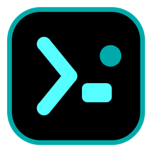
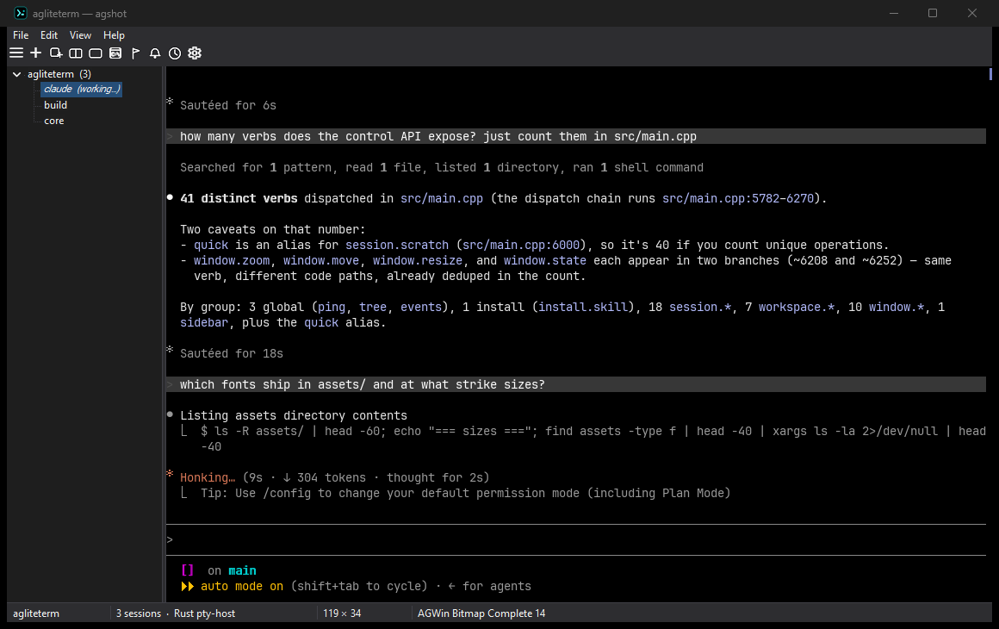

<div align="center">



# agliteterm

**A tiny native Windows terminal for AI coding agents.**

Part of the [agwinterm](https://github.com/yeroo/agwinterm) family: same Rust emulator core, same
pty-host, same control API — a fraction of the footprint. One small C++ exe, **no .NET runtime**,
real native Win32 controls.

**Feature parity with agwinterm is the goal, not a cut-down build.** What is still missing (and the
few places this one is ahead) is tracked in
[agwinterm/docs/lite-parity.md](https://github.com/yeroo/agwinterm/blob/main/docs/lite-parity.md),
kept there because the control-API contract is canonical in that repo. Both products' standing
against umputun's agterm is in
[agterm-parity.md](https://github.com/yeroo/agwinterm/blob/main/docs/agterm-parity.md).

[](https://github.com/yeroo/agliteterm/actions/workflows/ci.yml)
[](https://scorecard.dev/viewer/?uri=github.com/yeroo/agliteterm)
[](https://github.com/yeroo/agliteterm/releases)
[](https://github.com/yeroo/agliteterm/releases)
[](LICENSE)



</div>

---

> **Was `agwinterm-lite`.** An existing agwinterm-lite install is handed over by its own updater
> (agwinterm 0.17.4 points at this feed). agliteterm installs **alongside** rather than replacing it
> and adopts your sessions, settings and fonts on first run, so nothing is lost and you can go back.
> Scripts using `--pipe agwinterm-lite` keep working — the default instance answers on both names —
> and the `AGWINTERM_*` session variables are unchanged.

**agliteterm** is a minimal Windows terminal for old or low-RAM machines: a single small
C++ exe (Win32/WTL, no .NET) over the same Rust emulator core and pty-host that
[agwinterm](https://github.com/yeroo/agwinterm) uses. It trades custom-drawn chrome for **real
native controls** — menu bar, toolbar, TreeView sidebar, status bar — in the classic Windows look.

- **Themes**: Dark / Light / Classic / Auto (follows Windows) from *File → Properties*. Dark
  covers everything — menus, toolbar, sidebar, dialogs, scrollbars, title bar. **Classic** keeps
  the authentic raised-3D, pre-theme look.
- **Agent workflow**: per-session agent status (bold = blocked, italic = working), an
  **attention bell** that lights amber and jumps to the next blocked session, **flagged
  sessions** with a flagged-only view, **unread badges** (commands finished while a session was
  off-screen), workspace focus, sidebar **drag & drop**.
- **Terminals**: workspaces + sessions with restore, a 2-pane split, quick / scratch / overlay
  popup terminals, font catalog (incl. bundled Cozette, Tamzen, Terminus, Spleen, UNSCII &
  GNU Unifont bitmap fonts) — face and size are chosen once in Properties; there is deliberately
  **no zoom**, because a raster face only exists at the strike sizes its pack ships,
  MS-DOS/EGA palette, cmd.exe-style Properties dialog, fully rebindable keys (all unbound by
  default — keystrokes belong to your shell). The **sidebar text size** is set separately
  (*Properties → Sidebar text*), because wanting a bigger session list is not wanting a
  bigger terminal.
- **Clipboard**: select with the mouse and it is copied on release; **Ctrl+C copies a selection**
  and otherwise still interrupts the shell (Ctrl+Shift+C always copies); **right-click pastes**
  even while a full-screen app is grabbing the mouse — a TUI like Claude Code holds mouse mode on
  for its whole run, which is exactly when pasting matters. A program can drive the clipboard
  itself with **OSC 52**, and terminal queries get answered. Both bindings are on by default; the
  registry escape hatch is `RightClickPaste` / `CopyOnCtrlC` (DWORD `0`) under
  `HKCU\Software\agliteterm`.
- **Scriptable**: the same newline-JSON control pipe, speaking the `agwintermctl` dialect —
  43 verbs covering sessions, workspaces, windows, the sidebar and the tree (`agwintermctl --pipe
  agliteterm tree`). Shells get `AGWINTERM_*` env, so hooks and the agent skill work. Three
  read-only probes answer what an agent otherwise has to guess: `agwintermctl surface cursor`
  reports a pane's caret **column** as a bare integer, so an agent can tell an empty composer from
  a draft before typing into another agent's (a *different* column proves a draft; an equal one
  does not prove emptiness — a draft exactly one wrap width long parks the caret where it started,
  so back a match with `session text`; after a print into the last column it equals the pane
  width — clamp before indexing); every `tree` node carries `statusChangedAt`, epoch seconds
  of the last status **write**, restamped on every write including a re-assert of the same status,
  so a stale `"active"` shows its age; and `ping` names the running build (`agliteterm
  <version>`), which is what `agwintermctl version` reports as the app. `session type --stdin`
  takes the text from standard input as bytes — how quotes, newlines, runs of spaces and a
  leading `--` are sent, none of which survives the argv path (exactly one trailing newline is
  dropped; invalid UTF-8 is refused before anything is sent). The flag lives in the shared
  `agwintermctl`; lite's server side is unchanged. There is no `quick type`: the quick terminal
  is a hidden session, typed into as `session type --target <its id>` (the id arrives as a
  `session`/`created` event after `quick on`). And a call that answers `ok` did what was asked
  (parity batch P2): `session overlay open <cmd> --size-percent N` is validated as 1..100 and
  refused otherwise with nothing opened, and the reply carries the percentage **in effect** (a popup
  cannot be under 30x8 cells, so a small window raises a low one; a window that cannot be measured
  at all — minimised, or a client under 30x8 cells — is told what it got and why, with no number);
  `resize` moves the popup and refuses when none is open;
  `sidebar width [N]` reads or sets the divider (90..900 px, and never so wide that the terminal
  drops under 20 columns) and answers the width **in effect**, while an unknown sidebar op is
  refused instead of toggling; a bare `session new` lands in the **caller's** workspace, not the
  active one, and `--workspace` beside `--workspace-name` is refused; `window select` says
  `selected` only when the window really came to the front. No verb steals the foreground from
  the app you are typing in — a popup raises only when agliteterm already holds it, and flashes
  the taskbar button otherwise.
- **Multi-window**: every window is its own tiny process (`--pipe <name>`), all
  sharing one pty-host; `agwintermctl window new/list/select/...` drives them.
- **CLI**: `-p/--profile`, `-d/--dir`, `--maximized`, `--no-restore`, `--pipe` — the full app's
  flag names — plus `--diagnose` (see below).
- **Explains itself**: it keeps a small always-on log of its own decisions — session saves and
  restores (with counts, byte totals, and the exact error when a write fails), focus handoffs, and
  font/pack resolution — at `%LOCALAPPDATA%\agliteterm\agliteterm.log` (`agliteterm-<instance>.log` for named
  instances), rotating at ~1 MB into `.log.old`. It records what the client *did*, never terminal output,
  pasted text, or your command lines, so it's safe to attach to an issue.


## Install

```powershell
winget install yeroo.agliteterm
choco install agliteterm
```

Or grab **`agliteterm-setup-<version>.exe`** from
[Releases](https://github.com/yeroo/agliteterm/releases) — per-user, no admin. It self-updates from
that feed (*Help → Check for Updates*), verifying the SHA-256 the release API publishes for the
asset before applying anything.

**No installer at all**: `agliteterm-portable-<version>-win-x64.zip` is the same payload unzipped
where you like. Settings still live in `%LOCALAPPDATA%\agliteterm`, so a portable copy and an
installed one share their sessions. (This is what the Chocolatey package installs — the setup is
per-user and Chocolatey runs elevated, which would put agliteterm in the administrator's profile.)

Package-manager versions are deliberately sparser than releases: winget and Chocolatey are
human-moderated, so only **checkpoint** versions (`x.y.9`, `x.y.18`, ...) are submitted. Everything
between them ships here and through the in-app updater.

Every release carries a [Sigstore build-provenance attestation](https://github.com/yeroo/agliteterm/attestations):

```
gh attestation verify agliteterm-setup-<version>.exe --repo yeroo/agliteterm
```

## Session restore & the state file

agliteterm saves its workspaces and sessions whenever the tree changes and on exit, and rebuilds them on
the next launch (`--no-restore` starts empty instead). Everything about that is on disk and readable:

- **One state file per instance.** `%LOCALAPPDATA%\agliteterm\sessions.tsv` for the default
  instance, `sessions-<instance>.tsv` for a named one. **Because every window is its own
  process, each window restores only its own sessions** — sessions you created in
  `--pipe work` come back in `--pipe work`, never in the default window. That is the mundane
  reading of "my sessions are gone": right sessions, wrong window.
- **Format**: tab-separated UTF-8 text, `V1` header, one record per line — `W` workspace, `S` session
  (workspace index, name, app, cwd, then args), `F` flagged indices, `D` host session ids, `A` active
  workspace. The format grows by *adding* line types, so a file written by an older build still
  restores, a line type this build doesn't write is still honoured when it finds one (`O`, focused
  workspace), and a file from a **newer** build is read for the lines this one knows rather than
  thrown away.
- **What is saved**: the visible sessions, each with its *live* working directory (read from the
  shell process, so it follows you as you `cd`). Split-pane shells are hidden and deliberately not
  persisted — the split comes back as a single pane.
- **Writes are atomic, and keep one generation.** The save writes `sessions.tsv.tmp`, rotates the
  current file to **`sessions.tsv.bak`**, then renames the temp over the target — a crash or a full
  disk mid-write can no longer leave a truncated file where a good one was. A zero-session save is
  *refused* over a populated file (and says so in the log); the one legitimate empty is you closing
  the last session, which also deletes the `.bak` so what you just closed doesn't come back.
- **Restore order**: `sessions.tsv` → `.bak` if the primary is missing, empty, or parses to zero
  sessions → a fresh window. If the pty-host still holds the shells — lite was killed or the machine
  was shut down rather than closed — those shells are **still running** and get adopted live instead
  of relaunched. An adopted shell keeps everything it was running, and lite asks it to redraw, so the
  **screen comes back** — but the **scrollback does not**: it re-attaches to the live process with a
  fresh emulator, so only what is on screen is repainted, not the history the old window had. A shell
  that has already exited, or one another window is currently driving, is not adopted — it is
  relaunched (or left to its owner) instead.
- **Recovering by hand.** `--no-restore` starts empty, and the next save publishes *that* over
  `sessions.tsv` — but the generation you wanted survives as `sessions.tsv.bak`. **Copy the `.bak`
  somewhere safe first**: only one generation is kept, so the next save of the window you are looking
  at overwrites it in turn. Then close agliteterm, copy your saved file over `sessions.tsv`, and relaunch.
  `--diagnose` prints both files with their sizes (and the primary's contents), so you can tell which
  one holds your sessions before you copy anything.
- **"Restart everything"** (*File → Restart everything*) relaunches the **same** instance — it carries
  this window's `--pipe <name>` over, so it comes back reading the same state file. `--diagnose`
  prints the exact command line it would use.
- **A spec that won't start on this machine** (a profile whose exe only exists on your other PC, a
  cwd on an unmounted drive) stays in the tree as a `(failed to start)` entry with a note in its
  pane, rather than silently vanishing. Its name, workspace, cwd and args are kept and re-saved, so
  it starts normally again on the machine that has the app. Scripts can spot one without reading the
  log: `agwintermctl tree --json` reports `"failed"` and `"exited"` per session.

Every one of those branches names itself in `agliteterm.log`, and `test/restore-matrix.ps1` drives the
whole matrix — kill vs. graceful close, two windows at once, interrupted writes, `.bak` fallback,
bogus apps, old and future file formats — as regression cover.

If agliteterm exits at startup with **"pty-host did not become usable"**, a previous `agwinterm-ptyhost.exe`
is wedged: end it in Task Manager and relaunch. `agliteterm.log` records the connection attempt by attempt,
including the case it is really there for — a host left dying by a killed window, which answers a
handshake for a moment while refusing every real command.

## Reporting a problem

Run `agliteterm --diagnose` and attach its output plus `agliteterm.log`. The report is read-only and
safe to run while agliteterm is open; it prints the state file's path, whether that directory is genuinely
writable (a real write probe, which is what catches a redirected or policy-locked profile), the state
file's contents and its `.bak` generation, the resolved font, and the bundled pack inventory:

```
> agliteterm --diagnose
  version: 0.17.2
  instance: (default)
  restart cmdline: "C:\Users\you\AppData\Local\Programs\agliteterm\agliteterm.exe"
state
  dir: C:\Users\you\AppData\Local\agliteterm
  dir writable: yes
  session file: ...\sessions.tsv
    size: 59 bytes
    modified: 2026-07-31 20:14:02
  backup file: ...\sessions.tsv.bak (59 bytes)
```

Use `--pipe <instance> --diagnose` to ask about a named instance — it reports *that* instance's
state file, which is the one its window restores from.

## The other one: agwinterm

**[agwinterm](https://github.com/yeroo/agwinterm)** is the full terminal this one is a sibling of —
C#/.NET on Win32 + Direct2D, custom-drawn chrome, any TrueType font with ligatures, images and
sixel, a dashboard, profiles, themes, and the complete control API. If your machine can afford it,
take that one; agliteterm exists for the machines that cannot.

Neither is a cut-down build of the other. They are separate programs that agreed on an interface,
and the agreement is enforced rather than promised: `test/control-api.json` here mirrors the
canonical contract in agwinterm, `tools/check-contract.ps1` compares them on every build, and both
repositories run the same conformance steps in CI. It has already caught real drift in both
directions.

The emulator core and pty-host are agwinterm's, consumed here as ABI-pinned release artifacts — see
[Building](#building).

Both are by [Boris Kudriashov](https://github.com/yeroo), and both owe their design to
**[umputun's agterm](https://github.com/umputun/agterm)**, the macOS terminal that treated AI coding
agents as first-class citizens first. 💜

## Building

Needs MSVC with the **VC++ ATL component** (WTL rides on the ATL headers):

```powershell
./build.ps1                 # -> bin\agliteterm.exe
./installer/build.ps1       # -> installer\Output\agliteterm-setup-<ver>.exe
```

### The core it rides on

agliteterm does not build the emulator core or the shell host. `agwinterm_core.dll` and
`agwinterm-ptyhost.exe` come from [agwinterm](https://github.com/yeroo/agwinterm) as ABI-stamped
release assets, pinned by [`native/pinned.json`](native/pinned.json) and fetched by
`tools/fetch-native.ps1`.

That C ABI carries **no compatibility guarantee across versions** — `src/main.cpp` requires exactly
one `kRequiredAbi`, and a mismatched pair refuses to load. While the client and the core lived in
one tree, a drift could only survive until the next rebuild; across two repositories it could
survive a whole release cycle and reach users. So the fetch reads the release's published ABI
manifest and **fails the build** on a mismatch, rather than letting it fail at load on someone
else's machine.

To build against a core you are changing:

```powershell
./build.ps1 -NativeDir C:\src\agwinterm\native\target\release
```

## Tests

```powershell
./test/run-all.ps1
```

There is no C++ unit-test harness — the checks drive the **built exe** and assert on observable
behaviour: the diagnostics log, the state file, the control pipe, and the windows themselves.
Rules the suite obeys, each learned from a real incident:

- always a sandbox instance (`--pipe <name>`); never the default instance, which owns real state
- never inject global input (`keybd_event`/`SendInput`) — it lands wherever focus happens to be
- capture windows with `PrintWindow`, never `CopyFromScreen`, which grabs whatever overlaps

`restore-matrix.ps1` is the big one: 34 cells covering kill vs. graceful close, two windows at once,
interrupted writes, `.bak` fallback, bogus apps, and old and future file formats. The checks that
drive the control pipe need `agwintermctl` — from an installed agwinterm, from `bin/` (the fetch
pulls it when the pinned release publishes it), or `$env:AGWINTERMCTL`. They skip with a message
when it is absent rather than failing obscurely. A check that needs a client newer than the
fetched release — `--stdin`, a strict `--size-percent`, `sidebar width N`, the `caller` field, all
agwinterm #226 — probes the client first and SKIPs on an older one (`-Strict` turns that into a
failure, which is the release gate). To run them all, point `$env:AGWINTERMCTL` at an agwinterm
dev build: `<agwinterm>\src\Agwinterm.Ctl\bin\Release\net10.0-windows\agwintermctl.exe`.

