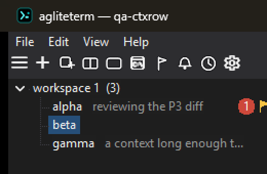
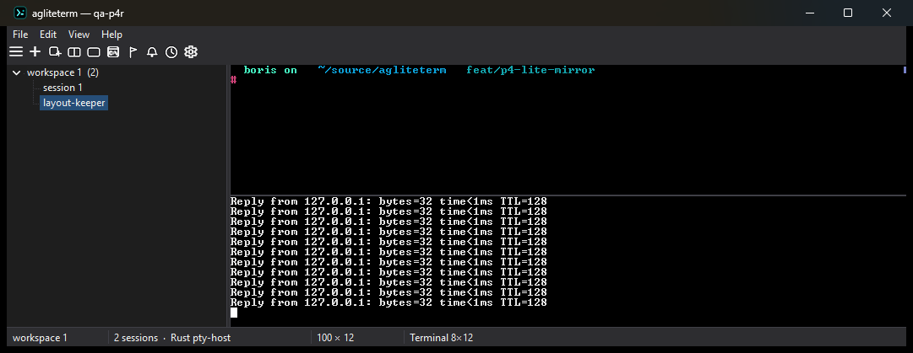
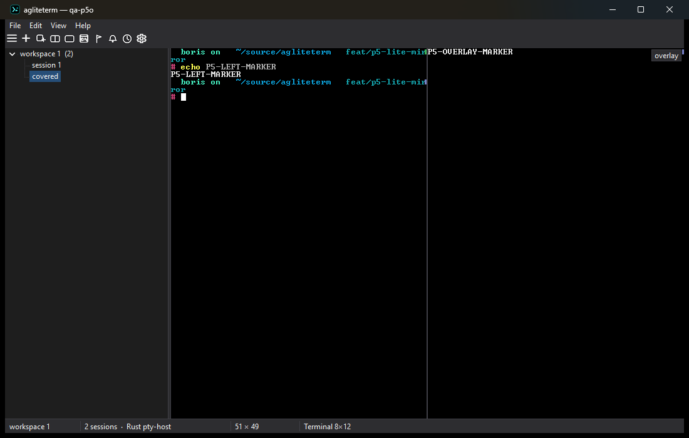

# agliteterm - a tiny native Windows terminal for AI coding agents

[](https://github.com/yeroo/agliteterm/actions/workflows/ci.yml)
[](https://scorecard.dev/viewer/?uri=github.com/yeroo/agliteterm)
[](https://github.com/yeroo/agliteterm/releases)
[](https://github.com/yeroo/agliteterm/releases)
[](LICENSE)

**[Releases](https://github.com/yeroo/agliteterm/releases)** · [User guide](docs/user-guide.md) · [Control API](docs/control-api.md) · [agwinterm](https://github.com/yeroo/agwinterm)

`agliteterm` is a minimal Windows terminal for old or low-RAM machines: one small C++ exe (Win32/WTL, **no .NET runtime**) with real native controls — menu bar, toolbar, TreeView sidebar, status bar — in the classic Windows look. Shells are organized into workspaces and sessions, and everything it holds is an object a script can address: the same `agwintermctl` CLI that drives agwinterm creates sessions and types into them, reads a pane's text back, runs a program in an overlay and returns its exit status, sets a session's status, and reads the whole tree back out over a local named pipe.

It is part of the [agwinterm](https://github.com/yeroo/agwinterm) family: same Rust emulator core, same pty-host, same control API, a fraction of the footprint. It exists for the machines that cannot afford the full app — old laptops, small VMs, remote desktops — and still need to run several coding agents at once, each in a named session that reports whether it is working, blocked, or done.

Feature parity with agwinterm is the goal, not a cut-down build. What is still missing, and the few places this one is ahead, is tracked in [agwinterm/docs/lite-parity.md](https://github.com/yeroo/agwinterm/blob/main/docs/lite-parity.md); both products' standing against umputun's agterm is in [agterm-parity.md](https://github.com/yeroo/agwinterm/blob/main/docs/agterm-parity.md).

What it does:

- **Workspaces and sessions.** Sessions are grouped under named workspaces in a native sidebar, with drag & drop, flags and a flagged-only view, and unread badges for commands that finished off-screen.
- **Agent status.** A coding agent reports its state onto its session's row (bold = blocked, italic = working), and an attention bell lights amber and jumps to the next blocked session. [Workspace attention](docs/workspace-attention.md) adds keyboard broadcast, clickable notifications and live dashboard previews.
- **Splits, popups and pane overlays.** Split a session left/right or top/bottom, open quick, scratch or overlay popups, or draw a command over one pane while the other stays interactive.
- **Control API and CLI.** 65 verbs over a newline-JSON pipe, in the `agwintermctl` dialect, including read-only probes an agent would otherwise have to guess at: a pane's caret column, the age of a status, the running build.
- **Session restore.** The tree is saved on every change with one backup generation. After a kill or a shutdown, shells still held by the pty-host are adopted live instead of relaunched.
- **Agent skill and hooks.** An installable skill teaches Claude Code or Codex the control model, and opt-in installers add status hooks, shell integration and the CLI on `PATH`.
- **Native and small.** Dark, Light, Classic and Follow-Windows themes; bundled bitmap fonts (Cozette, Tamzen, Terminus, Spleen, UNSCII, GNU Unifont); copy on select, right-click paste that works under a TUI, OSC 52.
- **Explains itself.** An always-on decision log that never records terminal output, and `agliteterm --diagnose` for bug reports.

For the terminal work, VT parsing and shell I/O, agliteterm uses agwinterm's Rust emulator core and pty-host, consumed as ABI-pinned release artifacts; the window, sidebar, persistence and control server are agliteterm's own.


<details>
<summary>More screenshots</summary>

A session context, dimmed after the name in the sidebar row, beside the unread pill and the flag:



A top/bottom split, restored with its layout after a restart:



A pane overlay over the right pane, while the left pane stays live:



</details>

## The model

- **Window.** A process of its own with its own control pipe (`--pipe <name>`), sidebar and state file. All windows share one pty-host.
- **Workspace.** A named group of sessions for one project or context.
- **Session.** One running shell with a name, a working directory, an optional one-line context, and its own scrollback. It is the row you see in the sidebar.
- **Split.** A session can hold two shells, left/right or top/bottom, sharing its one sidebar row.
- **Popups and overlays.** Quick, scratch and overlay terminals open over the session; a pane overlay covers just one pane. None of them is persisted.
- **Help.** `F1` (or Help ▸ Help, or the palette) opens a card with how agliteterm works and the effective key bindings, File ▸ Keyboard… and keymap.conf included; `Esc` closes it.

## Install

Pre-built releases are for **Windows x64**. The installer is per-user and needs no admin rights.

```powershell
winget install yeroo.agliteterm
choco install agliteterm
```

Direct download: grab **`agliteterm-setup-<version>.exe`** from [Releases](https://github.com/yeroo/agliteterm/releases). It self-updates from that feed (*Help ▸ Check for Updates*), verifying the SHA-256 the release API publishes for the asset before applying anything.

No installer at all: **`agliteterm-portable-<version>-win-x64.zip`** is the same payload, unzipped where you like. Settings still live in `%LOCALAPPDATA%\agliteterm`, so a portable copy and an installed one share their sessions. This is what the Chocolatey package installs: the setup is per-user and Chocolatey runs elevated, which would put agliteterm in the administrator's profile.

winget and Chocolatey are human-moderated, so only **checkpoint** versions (`x.y.9`, `x.y.18`, ...) are submitted there. Everything in between ships here and through the in-app updater.

Every release carries a [Sigstore build-provenance attestation](https://github.com/yeroo/agliteterm/attestations):

```powershell
gh attestation verify agliteterm-setup-<version>.exe --repo yeroo/agliteterm
```

The agent skill installs from *Help ▸ Install Agent Skill* (or the palette). The status hooks, shell integration and the CLI on `PATH` are opt-in `install` verbs on the control pipe; none of them runs automatically. [Commands and agent integration](docs/agent-integration.md) covers what each one writes and how to remove it.

<details>
<summary>Coming from <code>agwinterm-lite</code>?</summary>

agliteterm was `agwinterm-lite`. An existing agwinterm-lite install is handed over by its own updater (agwinterm 0.17.4 points at this feed). agliteterm installs **alongside** rather than replacing it and adopts your sessions, settings and fonts on first run, so nothing is lost and you can go back. Scripts using `--pipe agwinterm-lite` keep working — the default instance answers on both names — and the `AGWINTERM_*` session variables are unchanged.

</details>

## Scripting agliteterm

`agwintermctl` drives a running agliteterm over its named pipe, one command per invocation. Inside a pane `AGWINTERM_PIPE` is already set; from outside, add `--pipe agliteterm`. Terminal output is not streamed; `session text` reads a session's buffer when a script needs to see it.

```powershell
$sid = agwintermctl session new --name build --cwd C:\src\app               # the new session's id
agwintermctl session split on --axis horizontal --target $sid               # answers the new pane's id
agwintermctl session type "git status`n" --target $sid                      # drive a session you are not looking at
agwintermctl session text --target $sid --lines 10                          # read its terminal back
agwintermctl session status blocked --target $sid                           # the sidebar cue
agwintermctl session context "reviewing PR 91" --target $sid                # one line of what it is for
agwintermctl session new --name tests --command "npm test"                  # run PowerShell code, keep a prompt
agwintermctl tree --json                                                    # the whole model as JSON
```

`session type` returns once the keystrokes are queued, so a following `session text` races the shell. `session write` only paints, and the next repaint or resize paints over it.

The same interface covers windows, workspaces, splits, overlays, selection, search, configuration and restore. What lite answers, and where it differs from the full app, is in [docs/control-api.md](docs/control-api.md); the shared contract is canonical in [agwinterm](https://github.com/yeroo/agwinterm/blob/main/tests/conformance/control-api.json).

## Documentation

- [User guide](docs/user-guide.md): the window, themes and fonts, sessions, splits and popups, keys, clipboard, command-line flags.
- [Control API](docs/control-api.md): every verb family as lite answers it, with the deliberate differences from agwinterm.
- [Configuration](docs/configuration.md): `config` keys, shell profiles, oh-my-posh, captured-command replay.
- [Launching a session command](docs/session-commands.md): `session new --command`, direct mode, `--wait`.
- [Commands and agent integration](docs/agent-integration.md): custom commands, leader chords, installers, Claude adoption and restarts.
- [Workspace attention](docs/workspace-attention.md): broadcast, notifications, dashboard previews.
- [Session restore](docs/session-restore.md) and [the state file](docs/state-file.md): what is saved, the restore order, recovering by hand.
- [CONTRIBUTING.md](CONTRIBUTING.md): building, the pinned core, and the test suites.

Log locations, `--diagnose` and the common problems are in [docs/troubleshooting.md](docs/troubleshooting.md). Report bugs in [Issues](https://github.com/yeroo/agliteterm/issues).

## Related projects

- **[agwinterm](https://github.com/yeroo/agwinterm)** is the full terminal this one is a sibling of: C#/.NET on Win32 + Direct2D, custom-drawn chrome, any TrueType font with ligatures, images and sixel, a dashboard, profiles, themes, and the complete control API. If your machine can afford it, take that one; agliteterm exists for the machines that cannot.
- **[agterm](https://github.com/umputun/agterm)** by [umputun](https://github.com/umputun) is the macOS terminal both are modeled on.

Neither agwinterm nor agliteterm is a cut-down build of the other. They are separate programs that agreed on an interface, and the agreement is enforced rather than promised: `test/control-api.json` here mirrors the canonical contract in agwinterm, `tools/check-contract.ps1` compares them on every build, and both repositories run the same conformance steps in CI. It has already caught real drift in both directions.

## Attribution

agliteterm's design comes from **[umputun's agterm](https://github.com/umputun/agterm)**, the macOS terminal that treated AI coding agents as first-class citizens first. 💜

The emulator core (`agwinterm_core.dll`) and the shell host (`agwinterm-ptyhost.exe`) come from [agwinterm](https://github.com/yeroo/agwinterm). The UI is built on [WTL](https://sourceforge.net/projects/wtl/) (MS-PL, `third_party/wtl`). The bundled fonts keep their upstream licenses, shipped beside them in `assets/` and listed with versions in [THIRD_PARTY_FONTS.md](https://github.com/yeroo/agwinterm/blob/main/THIRD_PARTY_FONTS.md).

## License

MIT © Boris Kudriashov. See the [LICENSE](LICENSE) file.
