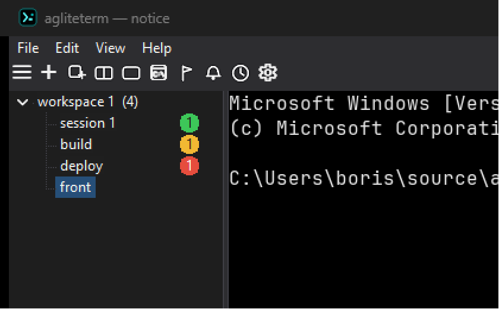
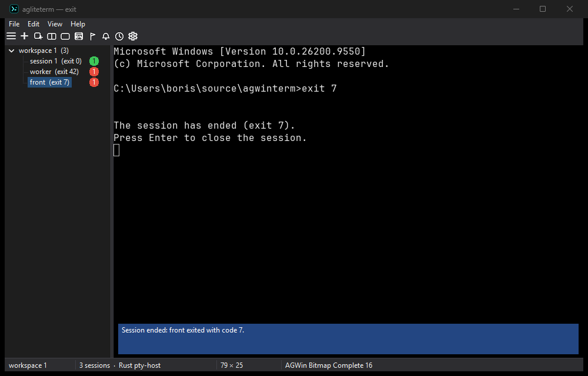

# Workspace input and attention

P12 implements five existing agwinterm verbs without adding canonical contract steps.

- `broadcast on|off|toggle|state` (`get` is a read alias): runtime-only, initially off. Human
  keyboard input targets a snapshot of the displayed session's workspace, including its splits.
  Readonly, exited and covered recipients are skipped. A blocked/reserved source blocks fanout.
  Popup/covered-source input is targeted; paste, API typing and mouse reports never fan out.
  A red content-area warning remains visible with the status bar hidden. Input uses duplicated
  pipe handles and bounded writes; unresolved cancellation retains its lease until completion,
  never schedules the bytes for later. Partial fanout is possible when a recipient refuses/fails.
- `notify BODY --title TITLE --category ok|normal|attention --target ID`: a separate notice badge,
  notification event and clickable eight-second banner. The badge takes the colour of the highest
  unread category (attention red, normal yellow, ok green; omitted = attention; any other value
  is refused and nothing is delivered). Finished commands count in the same badge and keep the
  red while no notice is unread. `notification-color-ok` / `-normal` / `-attention` (`#RRGGBB`)
  change the colours, and `tree --json` carries the highest unread category as `unreadCategory`.
  It requests a desktop balloon without raising the app; Windows
  may suppress it. Body/title are capped at 4096/256 UTF-8 bytes; balloon text is truncated to the
  Windows limits. Selecting the session or `session seen` clears the badge. A split pane maps
  to its owning session, while a popup/cover refuses. Notices are transient, not persisted;
  a newer banner replaces the previous one, but each target's badge and event remain.

  

- Shell exit: a one-pane session whose profile shell exits stays on screen. Its row says `(exit N)`
  and `tree --json` carries `exitCode` beside `exited` (the pty-host's code; absent when the host
  could not be asked). The pane prints `The session has ended (exit N).` and `Press Enter to close
  the session.`; a plain Enter in that pane closes the session. An exit nobody was looking at (the
  session not displayed, or the window not in the foreground) raises a notice, `ok` for code 0
  and `attention` otherwise. A session started with an explicit command (`session new --command`,
  and a saved spec that is not one of the profiles) keeps its buffer untouched, a split side still
  collapses to its survivor, and popups keep their own exit handling.

  
- `dashboard [ID ...] [--close]`: up to nine distinct tree sessions or the recent-session default.
  Arrows/Home/End choose a tile, Enter/Space/click activate it, Escape closes without switching.
  Keys/paste/mouse input cannot pass through. Previews use the existing fixed strike, clipped to
  each tile, without resizing shells; nonzero `--font-size` refuses. Previews show the session's
  primary shell viewport, not its split/cover, and do not mark notices seen. Closed items are
  pruned. The dashboard refuses while popup terminals are visible; opening a popup closes it.
  Pipe-only `args.op="state"` returns `{open,selected,ids}` for automation.
  Close cannot be combined with selectors; nonzero font-size refuses even with close.
- `workspace move --to up|down|top|bottom --target ID`: atomically reorder and remap live/hidden
  sessions, active/focused workspace and reopen history. Numeric workspace IDs are order indices,
  so they change after a move; exact names beat unique substring matches, ambiguity refuses.
  Boundaries do nothing. Saved order follows the move; a failed save reports the in-memory change.
  Workspace moves and opening the dashboard refuse during a menu or sidebar drag.
- `restore clear`: remove only this instance's primary, `.bak` fallback and `.tmp` restore files.
  Older snapshots are fenced under the save lock; newer concurrent saves may require a retry.
  A per-instance `.cleared` marker prevents legacy-profile re-import when no state files remain.
  No live session, pin or binding is changed. Later ordinary app saves, including normal exit, save them
  again: this is not a persistent restore-disable switch. Historical diagnostic files are not
  automatic fallback and are retained. Partial deletion reports the count and Windows errors.

The palette contains Broadcast and Dashboard; `keymap.conf` actions `toggle_broadcast` and
`dashboard` can be bound explicitly. No default chord is stolen from existing split/navigation.
Differences from agwinterm include stricter refusals, per-recipient readonly/lease gates,
fixed-strike previews rather than auto-zoom, and clearing lite's backup fallback as well as primary.
The old “all verbs except images” backlog sentence is not a compatibility guarantee: documented
font, graphics, profile-schema and other deliberate product differences remain.
